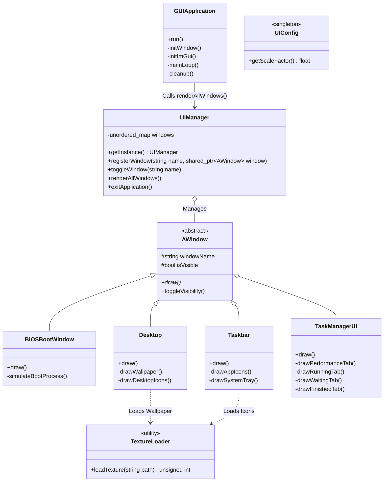

# CBOPESY OS Mockup: Architectural Diagram & Code Tracing

This document provides a high-level overview of the architecture and a step-by-step code trace of the CBOPESY OS Mockup.

## 1. Architectural Diagram

The application uses an immediate-mode GUI paradigm (Dear ImGui) integrated with an OpenGL 3/GLFW backend. The core architecture is modular, relying heavily on a centralized window management system.

---

## 2. Step-by-Step Code Tracing

### Phase 1: Initialization (`main()` -> `GUIApplication`)
1. **Entry Point**: The application starts in `main()` which instantiates the `GUIApplication` class and calls `run()`.
2. **Setup**: `GUIApplication::initWindow()` initializes GLFW, configures OpenGL context, and creates the main operating system window.
3. **ImGui Init**: `GUIApplication::initImGui()` initializes the Dear ImGui context and sets up the rendering backends (`ImGui_ImplGlfw_InitForOpenGL` and `ImGui_ImplOpenGL3_Init`).
4. **Window Registration**: The constructor of `GUIApplication` instantiates all specific window types (`BIOSBootWindow`, `Desktop`, `Taskbar`, `TaskManagerUI`, etc.) and registers them into the `UIManager` singleton.

### Phase 2: The Main Event Loop (`GUIApplication::run()`)
Once initialization is complete, the application enters an infinite `while (!glfwWindowShouldClose(window))` loop:
1. **Event Polling**: `glfwPollEvents()` processes keyboard, mouse, and window events.
2. **Frame Start**: `ImGui_ImplOpenGL3_NewFrame()`, `ImGui_ImplGlfw_NewFrame()`, and `ImGui::NewFrame()` are called to begin a new Immediate-Mode GUI frame.
3. **Rendering the UI**: `UIManager::getInstance().renderAllWindows()` is called. 
   - The `UIManager` iterates through its internal map of `AWindow` pointers.
   - For every window where `isVisible == true`, it calls the overridden `draw()` method.

### Phase 3: The Boot Sequence (State Management)
1. **Initial State**: When the app starts, only `BIOSBootWindow` has `isVisible = true`. `Desktop` and `Taskbar` are hidden.
2. **Boot Screen**: In `BIOSBootWindow::draw()`, a state machine simulates hardware memory checks and peripheral loading. A timer (`std::chrono::steady_clock`) is used to control delays.
3. **Transition to Desktop**: Once the simulated boot finishes, `BIOSBootWindow` calls `UIManager::getInstance()` to hide itself (`setVisible(false)`) and show the `Desktop` and `Taskbar` (`setVisible(true)`).

### Phase 4: Desktop & Taskbar Interaction
1. **Desktop Rendering**: `Desktop::draw()` uses `ImGui::GetBackgroundDrawList()` to draw an image texture (loaded via `TextureLoader::loadTexture`) filling the screen.
2. **Taskbar Rendering**: `Taskbar::draw()` uses a combination of `ImGui::ImageButton` and `ImGui::Button` to render icons aligned to the bottom of the screen.
3. **Event Triggers**: If a user clicks the "Chart" icon on the taskbar, the button click returns `true`. The code then invokes `UIManager::getInstance().toggleWindow("taskManager")`.

### Phase 5: Task Manager & Complex State Management
1. **Opening**: Toggling the "taskManager" sets `TaskManagerUI`'s `isVisible` to `true`. Next frame, `TaskManagerUI::draw()` executes.
2. **Tabs**: `ImGui::BeginTabBar` allows switching between Performance, Running, Waiting, Finished, and Processes tabs.
3. **Sorting & Logic**: In `TaskManagerUI.cpp`, lists of dummy processes are kept in a `std::vector<DummyProcess>`.
   - When ImGui detects a column header click (`ImGuiTableSortSpecs::SpecsDirty == true`), the unified helper function `sortProcesses()` is invoked to `std::sort` the vector by PID, Name, Core, or Status depending on the direction (Ascending/Descending).
4. **Graph Drawing**: `ImGui::PlotLines` is used inside the Performance tab to render the dynamic CPU and Memory arrays.

### Phase 6: Frame Finalization
After all visible windows have executed their ImGui calls:
1. **Render**: `ImGui::Render()` finalizes the UI layout.
2. **Draw Data**: `ImGui_ImplOpenGL3_RenderDrawData(ImGui::GetDrawData())` issues the actual OpenGL draw calls to the GPU.
3. **Swap Buffers**: `glfwSwapBuffers(window)` pushes the newly rendered frame to the monitor.
4. **Repeat**: The loop returns to Step 1 (Event Polling) at 60+ FPS.
