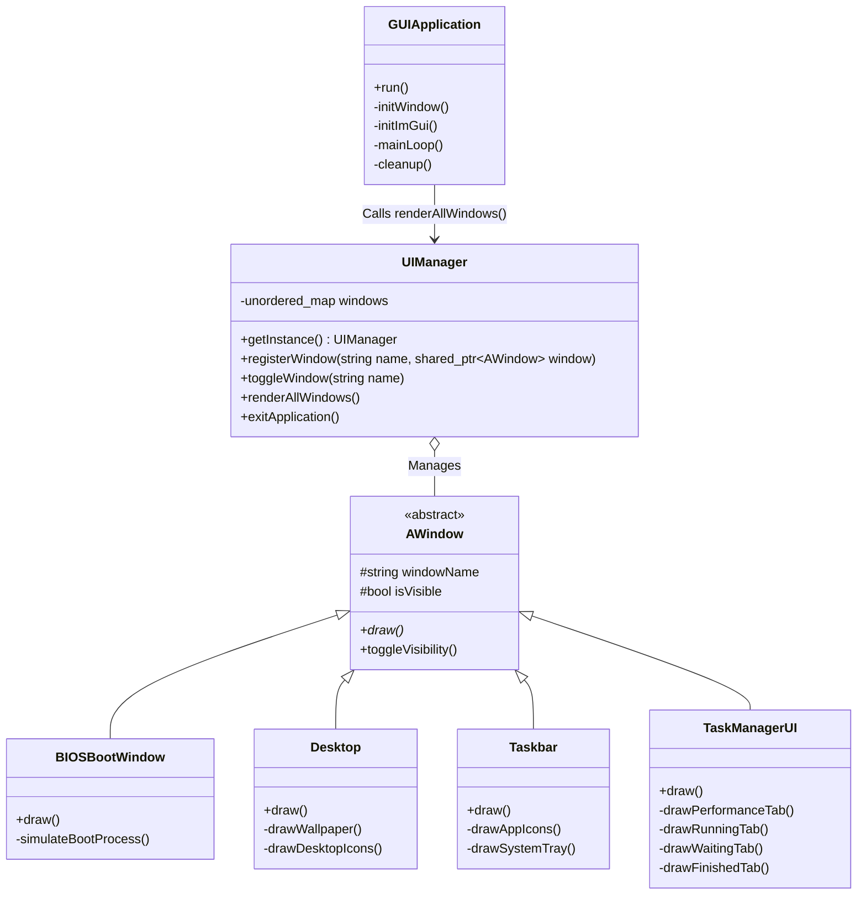

# Project: Desktop-Style OS Emulator

**CSOPESY Term 1 Report**

**Date**: June 13, 2026  
**Author**: [Your Name/Person]  
**Lead Architect**: Sean Marthy Arambulo  

---

## I. Video Walkthrough

Please insert a link to your hosted video demonstration below. The video should cover the execution of the GUI mockup, including the simulated boot process and window interactions.

**Link**: [Insert Video Link Here]

**Key Timestamp Highlights:**
- **00:00 - 00:08**: Simulated Bootstrapping Sequence (`BIOSBootWindow` timing logic and ASCII logo rendering).
- **00:09 - 00:30**: Transition to User Interface (Hiding BIOS, showing `Desktop` and `Taskbar`).
- **00:31 - 01:00**: Taskbar and Start Menu interaction (Toggling windows via `UIManager`).
- **01:01 - End**: Task Manager Mockup Data Visualization (Sorting dummy processes in `TaskManagerUI` and viewing randomized CPU/Memory plotting).

---

## II. Architectural Diagram

The application uses an immediate-mode GUI paradigm (Dear ImGui) integrated with an OpenGL 3/GLFW backend. The core architecture is modular, relying heavily on a centralized window management system rather than a real OS kernel.

| Layer | Component | Functionality |
| :--- | :--- | :--- |
| **User Space** | Immediate-Mode UI | Interaction via GUI. Represented by individual `AWindow` subclasses (`Desktop`, `Taskbar`, `TaskManagerUI`, `StartMenu`, `SearchWindow`, `ProcessWindow`). |
| **System Services** | Window Management | Handled by the `UIManager` singleton, which maintains a registry of all windows and manages their visibility states. |
| **Kernel** | Main Event Loop | Represented by `GUIApplication`, which manages the initialization of the GLFW window, the OpenGL context, and the continuous frame rendering loop. |
| **Hardware Abstraction** | OpenGL 3 / GLFW | The lowest level of the application, managing actual hardware rendering and OS-level window events (keyboard/mouse polling). |

### Class Diagram Overview


---

## III. Code Snippets: Kernel Lifecycle (The Five Phases)

The following implementation represents the execution sequence for the OS Emulator's mockup application lifecycle, directly mapping traditional OS kernel phases to our GUI architecture.

### Phase 1: Bootstrapping
In a traditional OS, this phase involves low-level hardware setup and loading the kernel into memory. In our emulator, this is represented by the initialization of our hardware abstraction layer (GLFW) and the immediate-mode GUI framework (Dear ImGui).

```cpp
// GUIApplication.cpp - inside initialize()
// Phase 1: Bootstrapping — hardware/window system setup
if (!glfwInit()) return false;

window = glfwCreateWindow(1280, 720, "CSOPESY", nullptr, nullptr);
glfwMakeContextCurrent(window);

// Initialize Dear ImGui
IMGUI_CHECKVERSION();
ImGui::CreateContext();
ImGui_ImplGlfw_InitForOpenGL(window, true);
ImGui_ImplOpenGL3_Init(glsl_version);
```

### Phase 2: Kernel Initialization
This phase sets up essential data structures, memory management, and interrupt handlers. Our equivalent initializes the central `UIManager` singleton (which acts as our window registry), sets up `UIConfig` for DPI scaling, and applies this scaling to ensure consistent rendering across displays.

```cpp
// GUIApplication.cpp - inside initialize()
// Phase 2: Kernel Initialization — set up data structures
UIConfig::initialize();
UIManager::getInstance().initialize();

float scaleFactor = UIConfig::getScaleFactor();
ImGui::GetStyle().ScaleAllSizes(scaleFactor);
ImGui::GetIO().FontGlobalScale = scaleFactor;
```

### Phase 3: Start System Services
An OS launches essential services, daemons, and background processes in this phase. The emulator achieves this by instantiating core `AWindow` objects (like `Desktop`, `Taskbar`, and `TaskManagerUI`) and registering them into the `UIManager`. Initially, only the `BIOSBootWindow` is shown to simulate the boot sequence, while the rest are hidden.

```cpp
// GUIApplication.cpp - inside initialize()
// Phase 3: Start System Services — launch core windows
auto desktop = std::make_shared<Desktop>();
auto taskbar = std::make_shared<Taskbar>();
auto biosWindow = std::make_shared<BIOSBootWindow>();
// ... other windows instantiated ...

UIManager::getInstance().registerWindow("desktop", desktop);
UIManager::getInstance().registerWindow("taskbar", taskbar);
UIManager::getInstance().registerWindow("bios", biosWindow);

// Initial state: hide desktop and taskbar, show BIOS
desktop->hide();
taskbar->hide();
biosWindow->show();
```

To simulate a real boot sequence where services initialize sequentially, the `BIOSBootWindow` employs time-based state transitions. Once its mock POST operations are completed, it triggers the `UIManager` to reveal the OS desktop services:

```cpp
// BIOSBootWindow.cpp - inside draw()
auto now = std::chrono::system_clock::now();
std::chrono::duration<float> elapsed = now - startTime;

if (elapsed.count() >= 27.0f) {
    // Transition to the primary User Interface
    UIManager::getInstance().hideWindow("bios");
    UIManager::getInstance().showWindow("desktop");
    UIManager::getInstance().showWindow("taskbar");
}
```

### Phase 4: Enter Main Loop
The OS enters an infinite loop to handle interrupts, dispatch processes, and perform I/O. The `GUIApplication::run()` method mimics this continuous operation at 60+ FPS, polling for window events, updating logic, rendering frames, and swapping buffers.

```cpp
// GUIApplication.cpp - inside run()
// Phase 4: Enter Main Loop — handle events, dispatch, I/O
while (!glfwWindowShouldClose(window) && !UIManager::getInstance().isApplicationClosing()) {
    // Poll hardware interrupts / input events
    glfwPollEvents();

    // Start a new ImGui frame
    ImGui_ImplOpenGL3_NewFrame();
    ImGui_ImplGlfw_NewFrame();
    ImGui::NewFrame();

    // Dispatch "processes" — update and render all active windows
    updateLogic();
    renderFrame();

    // Flush output to OpenGL rendering context
    ImGui::Render();
    // ... glClear and viewport setup ...
    ImGui_ImplOpenGL3_RenderDrawData(ImGui::GetDrawData());
    glfwSwapBuffers(window);
}
```

To fulfill the "dispatching processes" component of the main loop, the emulator relies on the `UIManager` singleton to iterate through all registered window objects. Only those actively marked as "shown" get their `draw()` methods executed, simulating process scheduling on a per-frame basis:

```cpp
// UIManager.cpp - inside renderAllWindows()
// Triggered by GUIApplication::renderFrame() every tick
void UIManager::renderAllWindows() {
    for (auto& [name, window] : windows) {
        if (window->isShown()) {
            window->draw();
        }
    }
}
```

During this phase, all active system services (like the Taskbar) are continuously redrawn. The Immediate-Mode GUI pattern requires these components to declare their structure and handle their own input polling every frame. For example, the `Taskbar` renders its application icons and listens for clicks simultaneously:

```cpp
// Taskbar.cpp - inside drawAppIcons()
// Renders the Start Button and handles its click event inline
if (DrawIconBtn("btn_start", startIcon, "START", ImVec2(100 * scale, 35 * scale))) {
    // Dispatches a signal to toggle the Start Menu's visibility
    UIManager::getInstance().toggleWindow("startMenu");
}

// Renders the Task Manager (Chart) icon
if (DrawIconBtn("btn_chart", chartIcon, "Chart")) {
    UIManager::getInstance().toggleWindow("taskManager");
}
```
This design completely eliminates the need for separate event listener registration or persistent UI object states typical in retained-mode GUIs.

### Phase 5: Shutdown and Cleanup
When the system halts or reboots, it gracefully terminates processes and releases memory. Once the main loop exits (e.g., via a window close event or an internal application exit flag), `GUIApplication::shutdown()` destroys the ImGui context, cleans up GLFW windows, and terminates the backend, ensuring no memory leaks.

```cpp
// GUIApplication.cpp - inside shutdown()
// Phase 5: Shutdown and Cleanup
if (window != nullptr) {
    ImGui_ImplOpenGL3_Shutdown();
    ImGui_ImplGlfw_Shutdown();
    ImGui::DestroyContext();

    glfwDestroyWindow(window);
    glfwTerminate();
    window = nullptr;
}
```

---

## IV. Design Discussion

The desktop-style OS is a mockup application engineered strictly in User Space using an Immediate-Mode Graphical User Interface (Dear ImGui). There is no actual operating system kernel, hardware scheduling, or memory allocation involved under the hood.

### 1. Centralized Window Management
Instead of system services, the architecture relies on the `UIManager`. It operates as a centralized Singleton that maintains an `std::unordered_map` of `AWindow` pointers. Interaction with elements, such as clicking a Taskbar icon, triggers `UIManager::getInstance().toggleWindow()` which updates the visibility state of application windows, effectively dictating what is rendered on the next immediate frame.

```cpp
// UIManager.cpp
void UIManager::toggleWindow(const std::string& name) {
    if (windows.find(name) != windows.end()) {
        if (windows[name]->isShown()) {
            windows[name]->hide();
        } else {
            windows[name]->show();
        }
    }
}
```

### 2. State-Based Boot Simulation
The `BIOSBootWindow` simulates a hardware POST and kernel boot through elapsed time evaluation (`std::chrono::system_clock::now()`). As time passes, new blocks of text are progressively rendered to the screen. Once a specific threshold is reached (e.g., 27 seconds), the state machine programmatically hides the BIOS screen and reveals the `Desktop` and `Taskbar`, providing a seamless visual transition to the OS interface.

```cpp
// BIOSBootWindow.cpp - Progressive text rendering based on time
if (elapsedSeconds > 5.5f) {
    ImGui::TextColored(white, "SMART Failure Predicted on M.2 : CORTEX BRAIN CHIP V3");
    ImGui::TextColored(white, "WARNING: Please back-up your memories and replace your brain chip.");
}
```

### 3. Immediate-Mode UI Architecture
Because the application leverages Dear ImGui, the GUI paradigm is purely immediate-mode. Every visual element is redrawn entirely from scratch on every frame. Instead of maintaining persistent GUI objects in memory, the application structure defines layouts continuously inside each frame's execution loop (e.g., inside the `draw()` methods of `AWindow` subclasses).

```cpp
// StartMenu.cpp - Stateless UI layout and interaction
// The entire structural layout and styling is reconstructed every frame.
if (ImGui::Begin("StartMenuWindow", nullptr, flags)) {
    ImGui::Columns(2, "StartMenuColumns", false);
    
    // Left Pane
    ImGui::Text("Recent Apps");
    ImGui::Separator();
    
    // No retained button object; drawn and evaluated for clicks inline
    if (ImGui::Button("Command Prompt", ImVec2(-1, 0))) {
        // Handle click event immediately
    }
    
    ImGui::NextColumn();
    
    // Right Pane (System Actions)
    // Styling is applied directly to the rendering pipeline and popped after
    ImGui::PushStyleColor(ImGuiCol_Button, ImVec4(0.8f, 0.1f, 0.1f, 1.0f));
    ImGui::PushStyleColor(ImGuiCol_ButtonHovered, ImVec4(1.0f, 0.2f, 0.2f, 1.0f));
    
    if (ImGui::Button("Shut down", ImVec2(-1, 0))) {
        UIManager::getInstance().exitApplication();
    }
    
    ImGui::PopStyleColor(2); // Must pop styling out of the immediate pipeline
    ImGui::Columns(1);
}
ImGui::End();
```

### 4. Data Mocking and Visualization
The "processes" and "performance metrics" displayed within the interface are purely structural data models. 
- The **Task Manager** stores predefined structures inside a `std::vector<DummyProcess>`. 
- **Sorting Logic**: Interactions with table columns dispatch `std::sort()` against the vector based on the selected field (PID, Name, Core) and direction.
- **Hardware Graphs**: Hardware utilization is visualized using `ImGui::PlotLines`. The memory and CPU values are not tied to real system calls; they are randomly shifted across an array every frame using `<cstdlib>` random generation to create the illusion of active telemetry.

```cpp
// TaskManagerUI.cpp - Data Mocking & Sorting Logic

// 1. Faking hardware telemetry arrays via rotation and RNG
void TaskManagerUI::updatePerformanceData() {
    std::rotate(cpuHistory.begin(), cpuHistory.begin() + 1, cpuHistory.end());
    std::rotate(memoryHistory.begin(), memoryHistory.begin() + 1, memoryHistory.end());
    
    cpuHistory.back() = 10.0f + (std::rand() % 20); 
    memoryHistory.back() = 40.0f + (std::rand() % 10);
}

// 2. Rendering telemetry visually
void TaskManagerUI::drawPerformanceTab() {
    updatePerformanceData();
    ImGui::PlotLines("##CPU", cpuHistory.data(), cpuHistory.size(), 0, nullptr, 0.0f, 100.0f, ImVec2(0, 80));
    ImGui::PlotLines("##Memory", memoryHistory.data(), memoryHistory.size(), 0, nullptr, 0.0f, 100.0f, ImVec2(0, 80));
}

// 3. Dispatching table sorting based on ImGuiTableColumnSortSpecs
static void sortProcesses(std::vector<DummyProcess>& processes, ImGuiTableSortSpecs* sorts_specs, TableType type) {
    if (!sorts_specs || !sorts_specs->SpecsDirty || sorts_specs->SpecsCount == 0) return;

    const ImGuiTableColumnSortSpecs* sort_spec = &sorts_specs->Specs[0];
    
    // Reorders the dummy struct vector based on active column click
    std::sort(processes.begin(), processes.end(), [sort_spec, type](const DummyProcess& a, const DummyProcess& b) {
        if (sort_spec->SortDirection == ImGuiSortDirection_Ascending) {
            return compareDummyProcesses(a, b, sort_spec, type);
        } else {
            return compareDummyProcesses(b, a, sort_spec, type);
        }
    });
    sorts_specs->SpecsDirty = false; // Reset dirty flag after sorting
}
```

---

## V. Component Breakdown: GUI Desktop Elements Design & Implementation

The graphical desktop environment is constructed by compositing multiple borderless `ImGui` windows carefully anchored to specific screen coordinates. The following outlines how each `AWindow` inherited component operates within the emulator ecosystem:

### Component 1: The Desktop
The `Desktop` acts as the full-screen background and base visual layer of the OS, rendering as the very first element each frame to fill the entire application window. To simulate a static environment without interfering with traditional window dragging, it uses a stringent set of ImGui window flags to remove borders, disable resizing, and prevent it from being brought to the front. 

To fulfill system requirements, the Desktop features:
- **Wallpaper:** A loaded image texture drawn directly onto the low-level `ImDrawList`.
- **Real-Time Clock:** The current time is fetched and updated every frame, positioned in a fixed corner.
- **PWR Button:** A dedicated shutdown button that gracefully closes the application by exiting the main loop, rather than forcing a hard crash.

```cpp
// Desktop.cpp - draw() and drawClock()
ImGui::SetNextWindowPos(ImVec2(0, 0));
ImGui::SetNextWindowSize(io.DisplaySize);

ImGuiWindowFlags flags = ImGuiWindowFlags_NoTitleBar | ImGuiWindowFlags_NoResize | 
                         ImGuiWindowFlags_NoMove | ImGuiWindowFlags_NoCollapse | 
                         ImGuiWindowFlags_NoBringToFrontOnFocus | ImGuiWindowFlags_NoNavFocus;

if (!beginWindow(flags)) return;

// 1. Draw Background Wallpaper
if (wallpaperTexture != 0) {
    ImGui::GetWindowDrawList()->AddImage((void*)(intptr_t)wallpaperTexture, ImVec2(0, 0), io.DisplaySize);
}

// 2. Real-Time Clock updated every frame (called via drawClock())
auto now = std::chrono::system_clock::now();
std::time_t now_c = std::chrono::system_clock::to_time_t(now);
std::tm parts;
localtime_s(&parts, &now_c);
// ... string formatting ...
ImGui::SetCursorPos(ImVec2(io.DisplaySize.x - textSize.x - 20, 10)); // Fixed corner
ImGui::Text("%s", timeStr.c_str());

endWindow();
```

### 2. `StartMenu`: The Dynamic Menu Overlay
The `StartMenu` demonstrates how dynamic, relative-positioned elements are constructed. It is specifically anchored to the bottom-left of the screen, just above the Taskbar. It utilizes `ImGui::Columns` to create a structured two-pane layout mimicking a classic OS menu.

```cpp
// StartMenu.cpp - inside draw()
float scale = UIConfig::getScaleFactor();
float taskbarHeight = 60.0f * scale;
float startMenuWidth = 400.0f * scale;
float startMenuHeight = 500.0f * scale;

// Positioned strictly above the bottom taskbar
ImGui::SetNextWindowPos(ImVec2(0, io.DisplaySize.y - taskbarHeight - startMenuHeight), ImGuiCond_Always);
ImGui::SetNextWindowSize(ImVec2(startMenuWidth, startMenuHeight), ImGuiCond_Always);

if (ImGui::Begin("StartMenuWindow", nullptr, flags)) {
    // Utilize columns to create the classic two-pane layout
    ImGui::Columns(2, "StartMenuColumns", false);
    ImGui::SetColumnWidth(0, startMenuWidth * 0.6f);

    // Left Pane (Apps)
    ImGui::Text("Recent Apps");
    ImGui::Separator();
    ImGui::Button("Command Prompt", ImVec2(-1, 0));
    
    ImGui::NextColumn();

    // Right Pane (Folders & System)
    ImGui::Text("User");
    ImGui::Separator();
    ImGui::Button("Documents", ImVec2(-1, 0));

    ImGui::Columns(1);
}
ImGui::End();
```

### Component 2: The Taskbar
Anchored as a fixed panel to the absolute bottom of the screen, the `Taskbar` provides consistent access to system functions and active applications. It operates as the primary interaction hub, dispatching visibility state changes to other window components via the centralized `UIManager`. 

The Taskbar is designed with three primary clickable icon buttons:
- **Start Menu Button:** Toggles a uniquely designed system menu overlay.
- **Search Button:** Opens a unique UI screen featuring a placeholder system search query interface.
- **Task Manager Button:** Dedicated specifically to launching the system's telemetry and process management window.

```cpp
// Taskbar.cpp - Anchoring to the bottom of the screen
float taskbarHeight = 60.0f * UIConfig::getScaleFactor();
ImGui::SetNextWindowPos(ImVec2(0, io.DisplaySize.y - taskbarHeight));
ImGui::SetNextWindowSize(ImVec2(io.DisplaySize.x, taskbarHeight));

// Three clickable buttons fulfilling the requirement using a custom DrawIconBtn lambda:

// 1. Unique UI Screen (Start Menu)
if (DrawIconBtn("btn_start", startIcon, "START", ImVec2(100 * scale, 35 * scale))) {
    UIManager::getInstance().toggleWindow("startMenu");
}
ImGui::SameLine();

// 2. Unique UI Screen (Search)
if (DrawIconBtn("btn_search", searchIcon, "Search")) {
    UIManager::getInstance().toggleWindow("search");
}
ImGui::SameLine();

// 3. Task Manager Button
if (DrawIconBtn("btn_chart", chartIcon, "Chart")) {
    UIManager::getInstance().toggleWindow("taskManager");
}
```

### 4. `BIOSBootWindow`: Simulated Entry Sequence
Unlike standard desktop elements, this window operates entirely on a time-based state machine powered by `std::chrono`. It temporarily obscures the rest of the application during launch, sequentially writing mocked diagnostic strings to the screen to simulate a hardware POST operation before revealing the primary interface.

```cpp
// BIOSBootWindow.cpp - Animating text over time
auto now = std::chrono::system_clock::now();
std::chrono::duration<float> elapsed = now - startTime;
float elapsedSeconds = elapsed.count();

// Renders memory counting up over a 1 second duration
if (elapsedSeconds > 2.5f) {
    int memCount = (int)(65536 * ((elapsedSeconds - 2.5f) / 1.0f));
    if (memCount > 65536) memCount = 65536;
    ImGui::TextColored(white, "Total Memory: %dMB (DDR6-12800)", memCount);
}
```

### Component 3: The Task Manager
Designed to closely resemble the Windows Task Manager, this window serves as the core telemetry interface and represents the most complex UI structure in the emulator. It handles:
- **Tabbed Layouts**: Segregating running, waiting, and terminated dummy processes.
- **Sortable Tables**: Using `ImGui::BeginTable` and `ImGuiTableFlags_Sortable` alongside `std::sort()` to dynamically re-order processes based on column headers.
- **Hardware Graphical Plotting**: Rendering CPU and Memory mock arrays over time utilizing `ImGui::PlotLines`.

```cpp
// TaskManagerUI.cpp - Constructing a sortable data table (drawRunningTab)
if (ImGui::BeginTable("RunningTable", 5, ImGuiTableFlags_Resizable | ImGuiTableFlags_Sortable | ImGuiTableFlags_Borders)) {
    ImGui::TableSetupColumn("PID");
    ImGui::TableSetupColumn("Name");
    ImGui::TableSetupColumn("Core");
    ImGui::TableSetupColumn("Progress");
    ImGui::TableSetupColumn("Lines");
    ImGui::TableHeadersRow();
    
    sortProcesses(dummyProcesses, ImGui::TableGetSortSpecs(), TableType::RUNNING);

    for (const auto& process : dummyProcesses) {
        if (process.state != ProcessState::RUNNING) continue;
        
        ImGui::TableNextRow();
        
        ImGui::TableSetColumnIndex(0);
        ImGui::Text("%d", process.pid);
        // ...
    }
    ImGui::EndTable();
}
```

### 6. `ProcessWindow` & `SearchWindow`: Auxiliary Interface Mockups
These two classes function as simple floating utility windows. 
- **`ProcessWindow`**: A placeholder dialog displaying specific metadata (PID, core usage) for a selected process, featuring mocked "Kill" and "Pause" buttons.
- **`SearchWindow`**: A simplistic search bar interface utilizing `ImGui::InputText`, designed as a future hook for querying the filesystem or registered applications.

```cpp
// SearchWindow.cpp - draw()
static char buf[128] = "";
ImGui::InputText("Query", buf, IM_ARRAYSIZE(buf));

if (ImGui::Button("Search")) {
    // Do nothing for now
}

// ProcessWindow.cpp - draw()
if (ImGui::Button(isPaused ? "Resume" : "Pause")) {
    isPaused = !isPaused;
}

ImGui::SameLine();

if (ImGui::Button("Kill Process")) {
    // Mock kill functionality
    isVisible = false;
}
```
