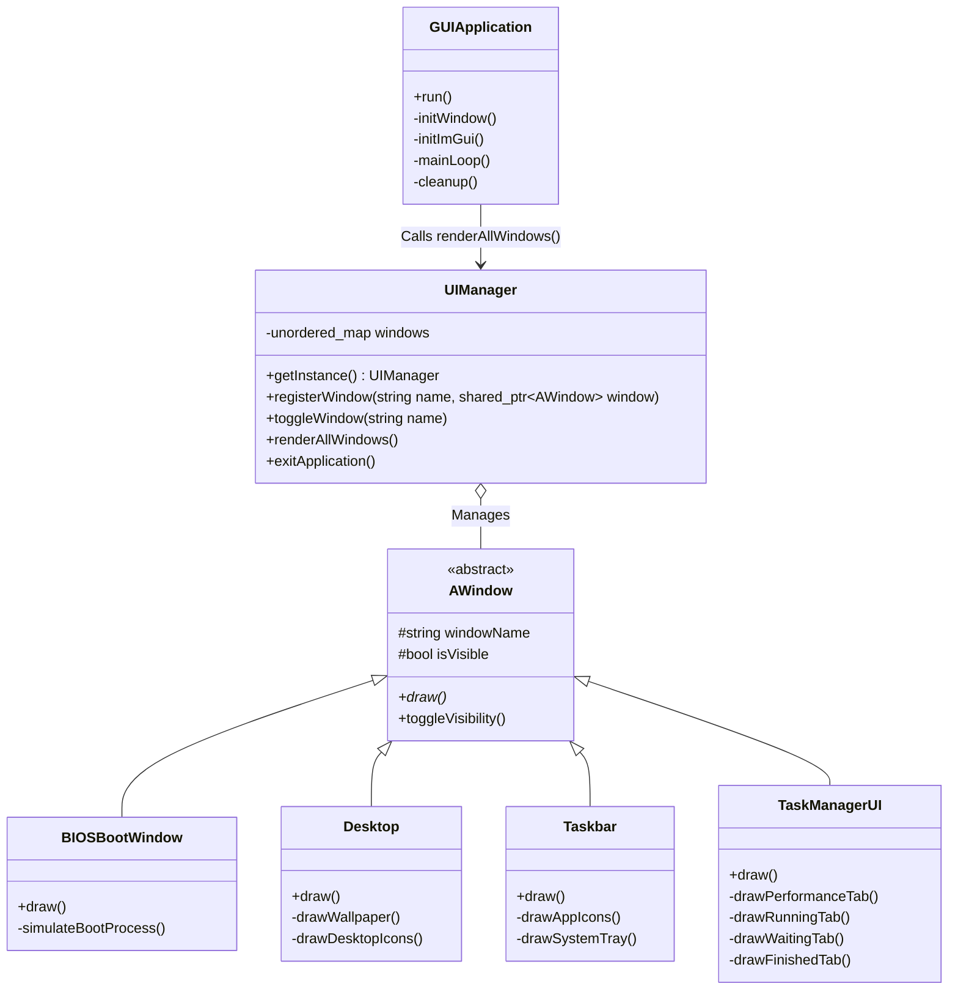

# Project: Desktop-Style OS Emulator

**CSOPESY Term 1 Report**

**Date**: June 13, 2026  
**Author**: [Your Name/Person]  
**Lead Architect**: Sean Marthy Arambulo  

---

## I. Video Walkthrough

Please insert a link to your hosted video demonstration below. The video should cover the execution of the GUI mockup, including the simulated boot process and window interactions.

**Link**: [Insert Video Link Here]

**Key Timestamp Highlights:**
- **00:00 - 00:08**: Simulated Bootstrapping Sequence (`BIOSBootWindow` timing logic and ASCII logo rendering).
- **00:09 - 00:30**: Transition to User Interface (Hiding BIOS, showing `Desktop` and `Taskbar`).
- **00:31 - 01:00**: Taskbar and Start Menu interaction (Toggling windows via `UIManager`).
- **01:01 - End**: Task Manager Mockup Data Visualization (Sorting dummy processes in `TaskManagerUI` and viewing randomized CPU/Memory plotting).

---

## II. Architectural Diagram

The application uses an immediate-mode GUI paradigm (Dear ImGui) integrated with an OpenGL 3/GLFW backend. The core architecture is modular, relying heavily on a centralized window management system rather than a real OS kernel.

| Layer | Component | Functionality |
| :--- | :--- | :--- |
| **User Space** | Immediate-Mode UI | Interaction via GUI. Represented by individual `AWindow` subclasses (`Desktop`, `Taskbar`, `TaskManagerUI`, `StartMenu`, `SearchWindow`, `ProcessWindow`). |
| **System Services** | Window Management | Handled by the `UIManager` singleton, which maintains a registry of all windows and manages their visibility states. |
| **Kernel** | Main Event Loop | Represented by `GUIApplication`, which manages the initialization of the GLFW window, the OpenGL context, and the continuous frame rendering loop. |
| **Hardware Abstraction** | OpenGL 3 / GLFW | The lowest level of the application, managing actual hardware rendering and OS-level window events (keyboard/mouse polling). |

### Class Diagram Overview


---

## III. Code Snippets: Kernel Lifecycle (The Five Phases)

The following implementation represents the execution sequence for the OS Emulator's mockup application lifecycle, directly mapping traditional OS kernel phases to our GUI architecture.

### Phase 1: Bootstrapping
In a traditional OS, this phase involves low-level hardware setup and loading the kernel into memory. In our emulator, this is represented by the initialization of our hardware abstraction layer (GLFW) and the immediate-mode GUI framework (Dear ImGui).

```cpp
// GUIApplication.cpp - inside initialize()
// Phase 1: Bootstrapping — hardware/window system setup
if (!glfwInit()) return false;

window = glfwCreateWindow(1280, 720, "CSOPESY", nullptr, nullptr);
glfwMakeContextCurrent(window);

// Initialize Dear ImGui
IMGUI_CHECKVERSION();
ImGui::CreateContext();
ImGui_ImplGlfw_InitForOpenGL(window, true);
ImGui_ImplOpenGL3_Init(glsl_version);
```

### Phase 2: Kernel Initialization
This phase sets up essential data structures, memory management, and interrupt handlers. Our equivalent initializes the central `UIManager` singleton (which acts as our window registry), sets up `UIConfig` for DPI scaling, and applies this scaling to ensure consistent rendering across displays.

```cpp
// GUIApplication.cpp - inside initialize()
// Phase 2: Kernel Initialization — set up data structures
UIConfig::initialize();
UIManager::getInstance().initialize();

float scaleFactor = UIConfig::getScaleFactor();
ImGui::GetStyle().ScaleAllSizes(scaleFactor);
ImGui::GetIO().FontGlobalScale = scaleFactor;
```

### Phase 3: Start System Services
An OS launches essential services, daemons, and background processes in this phase. The emulator achieves this by instantiating core `AWindow` objects (like `Desktop`, `Taskbar`, and `TaskManagerUI`) and registering them into the `UIManager`. Initially, only the `BIOSBootWindow` is shown to simulate the boot sequence, while the rest are hidden.

```cpp
// GUIApplication.cpp - inside initialize()
// Phase 3: Start System Services — launch core windows
auto desktop = std::make_shared<Desktop>();
auto taskbar = std::make_shared<Taskbar>();
auto biosWindow = std::make_shared<BIOSBootWindow>();
// ... other windows instantiated ...

UIManager::getInstance().registerWindow("desktop", desktop);
UIManager::getInstance().registerWindow("taskbar", taskbar);
UIManager::getInstance().registerWindow("bios", biosWindow);

// Initial state: hide desktop and taskbar, show BIOS
desktop->hide();
taskbar->hide();
biosWindow->show();
```

To simulate a real boot sequence where services initialize sequentially, the `BIOSBootWindow` employs time-based state transitions. Once its mock POST operations are completed, it triggers the `UIManager` to reveal the OS desktop services:

```cpp
// BIOSBootWindow.cpp - inside draw()
auto now = std::chrono::system_clock::now();
std::chrono::duration<float> elapsed = now - startTime;

if (elapsed.count() >= 27.0f) {
    // Transition to the primary User Interface
    UIManager::getInstance().hideWindow("bios");
    UIManager::getInstance().showWindow("desktop");
    UIManager::getInstance().showWindow("taskbar");
}
```

### Phase 4: Enter Main Loop
The OS enters an infinite loop to handle interrupts, dispatch processes, and perform I/O. The `GUIApplication::run()` method mimics this continuous operation at 60+ FPS, polling for window events, updating logic, rendering frames, and swapping buffers.

```cpp
// GUIApplication.cpp - inside run()
// Phase 4: Enter Main Loop — handle events, dispatch, I/O
while (!glfwWindowShouldClose(window) && !UIManager::getInstance().isApplicationClosing()) {
    // Poll hardware interrupts / input events
    glfwPollEvents();

    // Start a new ImGui frame
    ImGui_ImplOpenGL3_NewFrame();
    ImGui_ImplGlfw_NewFrame();
    ImGui::NewFrame();

    // Dispatch "processes" — update and render all active windows
    updateLogic();
    renderFrame();

    // Flush output to OpenGL rendering context
    ImGui::Render();
    // ... glClear and viewport setup ...
    ImGui_ImplOpenGL3_RenderDrawData(ImGui::GetDrawData());
    glfwSwapBuffers(window);
}
```

During this phase, all active system services (like the Taskbar) are continuously redrawn. The Immediate-Mode GUI pattern requires these components to declare their structure and handle their own input polling every frame. For example, the `Taskbar` renders its application icons and listens for clicks simultaneously:

```cpp
// Taskbar.cpp - inside drawAppIcons()
// Renders the Start Button and handles its click event inline
if (DrawIconBtn("btn_start", startIcon, "START", ImVec2(100 * scale, 35 * scale))) {
    // Dispatches a signal to toggle the Start Menu's visibility
    UIManager::getInstance().toggleWindow("startMenu");
}

// Renders the Task Manager (Chart) icon
if (DrawIconBtn("btn_chart", chartIcon, "Chart")) {
    UIManager::getInstance().toggleWindow("taskManager");
}
```
This design completely eliminates the need for separate event listener registration or persistent UI object states typical in retained-mode GUIs.

### Phase 5: Shutdown and Cleanup
When the system halts or reboots, it gracefully terminates processes and releases memory. Once the main loop exits (e.g., via a window close event or an internal application exit flag), `GUIApplication::shutdown()` destroys the ImGui context, cleans up GLFW windows, and terminates the backend, ensuring no memory leaks.

```cpp
// GUIApplication.cpp - inside shutdown()
// Phase 5: Shutdown and Cleanup
if (window != nullptr) {
    ImGui_ImplOpenGL3_Shutdown();
    ImGui_ImplGlfw_Shutdown();
    ImGui::DestroyContext();

    glfwDestroyWindow(window);
    glfwTerminate();
    window = nullptr;
}
```

---

## IV. Design Discussion

The desktop-style OS is a mockup application engineered strictly in User Space using an Immediate-Mode Graphical User Interface (Dear ImGui). There is no actual operating system kernel, hardware scheduling, or memory allocation involved under the hood.

### 1. Centralized Window Management
Instead of system services, the architecture relies on the `UIManager`. It operates as a centralized Singleton that maintains an `std::unordered_map` of `AWindow` pointers. Interaction with elements, such as clicking a Taskbar icon, triggers `UIManager::getInstance().toggleWindow()` which updates the visibility state of application windows, effectively dictating what is rendered on the next immediate frame.

### 2. State-Based Boot Simulation
The `BIOSBootWindow` simulates a hardware POST and kernel boot through elapsed time evaluation (`std::chrono::system_clock::now()`). As time passes, new blocks of text are progressively rendered to the screen. Once a specific threshold is reached (e.g., 27 seconds), the state machine programmatically hides the BIOS screen and reveals the `Desktop` and `Taskbar`, providing a seamless visual transition to the OS interface.

### 3. Immediate-Mode UI Architecture
Because the application leverages Dear ImGui, the GUI paradigm is purely immediate-mode. Every visual element is redrawn entirely from scratch on every frame. Instead of maintaining persistent GUI objects in memory, the application structure defines layouts continuously inside each frame's execution loop (e.g., inside the `draw()` methods of `AWindow` subclasses).

### 4. Data Mocking and Visualization
The "processes" and "performance metrics" displayed within the interface are purely structural data models. 
- The **Task Manager** stores predefined structures inside a `std::vector<DummyProcess>`. 
- **Sorting Logic**: Interactions with table columns dispatch `std::sort()` against the vector based on the selected field (PID, Name, Core) and direction.
- **Hardware Graphs**: Hardware utilization is visualized using `ImGui::PlotLines`. The memory and CPU values are not tied to real system calls; they are randomly shifted across an array every frame using `<cstdlib>` random generation to create the illusion of active telemetry.
